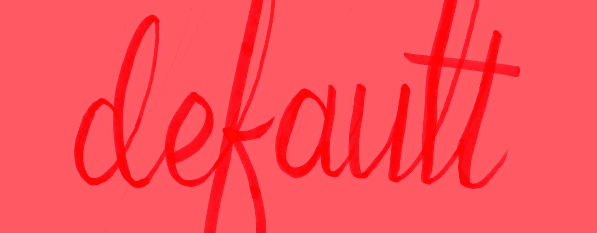

[](https://github.com/kennethormandy/default)

***

# Default

A starting points for certain projects.

## Getting started

Here’s where you write really fantastic instructions that helps people who may or may not even understand what Git is, use your project. For example, your sentences should probably be better than that one.

```bash
git clone https://github.com/kennethormandy/default
```

1. Replace “Default” and “default” with your new repository’s name
2. Replace references to “kennethormandy” and my email with your details (unless you are me—which you probably are)
3. Make sure you’re onboard with what’s in [the contributing guide](CONTRIBUTING.md)
4. Fill out the rest of the [`package.json`](package.json)
5. As appropriate, add your company to the copyright statement below in [the license](LICENSE.md):

    ```markdown
    Copyright © 2014 [Kenneth Ormandy](http://kennethormandy.com) & [Chloi Inc.](http://chloi.io)
    ```

6. Change the remotes and reset history

    ```sh
    # Carefully ensure you are where you want to be,
    # and remove the existing git history
    rm -rf .git/

    # Re-initialise the project
    git init

    # Add your remote repository
    git remote add origin https://github.com/kennethormandy/default
    ```

## License

[The MIT License (MIT)](LICENSE.md)

Copyright © 2014 [Kenneth Ormandy](http://kennethormandy.com)
